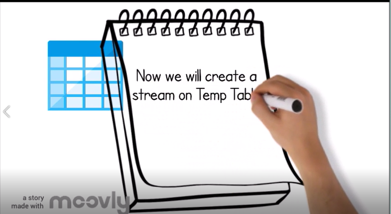

# Covid19 prediction model (Streams and Tasks)

Now we are using the merge command to update the data in the PREDICTION table by merging the actual data from INDIA_DATA and predicted data, date from PREDICTION. For this i will create stream and task in snowflake 

<video width="320" height="240" controls>
  <source src="stream.mp4" type="video/mp4">
</video>

What does stream do????

Stream captures the change in the data.So we will create a stream on Temp_table as we are updating the prediction in temp_table. So stream will capture the change in data in the temp_table.

>> create or replace stream COVID_table_changes on table TEMP_TABLE;

Our stream contains the columns of the temp_table .Additionally, there are three new columns you can use to find out what type of DML operations changed data in a source table: METADATA$ACTION, METADATA$ISUPDATE, and METADATA$ROW_ID.

Now whenever we will update the temp_table stream will capture those changes and we will use it for triggering our task.So let’s create a task , first we will create a role taskadmin , then change our role to accountadmin so that we can give task admin permission to execute task

>> <pre>--Set up TASKADMIN roleuse role securityadmin;
>> create role taskadmin;
>> -- Set the active role to ACCOUNTADMIN before granting the EXECUTE TASK privilege to TASKADMINuse role accountadmin;
>> grant execute task on account to role taskadmin;grant role taskadmin to role sysadmin;
>> -- Set the active role to SYSADMIN to show that this role can grant a role to another role use role sysadmin;</pre>

Tasks require a separate warehouse to run, so let’s create a task warehouse if one doesn’t exist:

>> create warehouse if not exists task_warehouse with warehouse_size = 'XSMALL' auto_suspend = 120;

Now we will create a task for updating the prediction table which will be triggered with the covid_table_changes stream.

>> <pre> create or replace task UPDATE_PREDICTION warehouse = TASK_WAREHOUSE schedule = '1 minute' when system$stream_has_data('COVID_TABLE_CHANGES')
>> as 
>> MERGE INTO PREDICTION P USING TEMP_TABLE T ON (P.DATE = T.DATE)
>> WHEN MATCHED THEN 
>>         UPDATE SET P.PREDICTION_INFECTED = T.INFECTED
>>WHEN NOT MATCHED THEN 
>>         INSERT(DATE,PREDICTION_INFECTED) VALUES (T.DATE,T.INFECTED)</pre>

We need to resume the task so that it can be started always after creating the task . You just have to resume it once.

>> ALTER TASK UPDATE_PREDICTION RESUME;SHOW TASKS

Create a stream on prediction table (prediction_table_changes)

>> create or replace stream PREDICTION_table_changes on table PREDICTION;

Now we will create another task to update the infected people data into a prediction table.

>> <pre>create or replace task UPDATE_INDIA warehouse = TASK_WAREHOUSE schedule = '1 minute' when system$stream_has_data('PREDICTION_table_changes')
>> as 
>> MERGE INTO PREDICTION P USING INDIA_DATA I ON (I.DATE = P.DATE) 
>> WHEN MATCHED THEN 
>>            UPDATE SET P.INFECTED = I.TOTAL_CASES+I.NEW_CASES

Resume the UPDATE_INDIA task

>>ALTER TASK UPDATE_INDIA RESUME;
>>SHOW TASKS

So, this is how we are creating a data pipeline for our prediction of covid19 cases I hope this project helped you to understand. In the next part we will do the visualization of our data.

